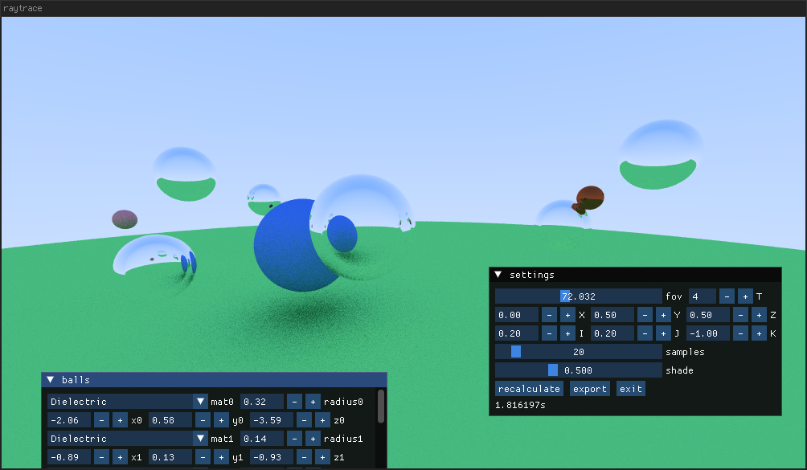

# raytracer

An implementation of raytracing in modern C++, based on code from the [Ray Tracing in One Weekend](https://raytracing.github.io/) book series. This implementation uses multi-threading, ranges, and [imgui](https://github.com/ocornut/imgui) to provide an interactive rendering experience.

UI controls include:

* Field of view
* CPU thread/worker count
* XYZ camera position
* IJK camera "look at" position
* Samples count to control render quality
* Global shade control for "day" or "night" rendering
* "balls" window: Add or remove spheres and set each sphere's material, size, and position

The UI also does low-quality "live" rendering as settings are changed; click "recalculate" to render in high-quality. The visible render can be exported as a PNG image to the current directory.

## Build instructions

1. Download imgui submodule via `git submodule`.
2. Have GCC, GNU Make, and SDL2 installed.
3. Run 'make'.

The final program binary is called `main`.
